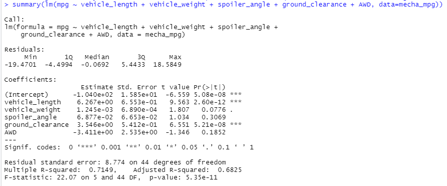

# MechaCar_Statistical_Analysis

## Overview:
AutosRUs' newest prototype, the MechaCar, is suffering from production troubles that are blocking the manufacturing team's progress. AutosRU's upper management wants the data analyytics team to review the production data for insights that may help the manufacturing team.

## Purpose
The purpose of this project is to:
-Perform multiple linear regression analysis to identify which variables in the dataset predict the mpg of MechaCar prototypes.
-Collect summary statistics on the pounds per square inch (PSI) of the suspension coils from the manufacturing lots
-Run t-tests to determine if the manufacturing lots are statistically different from the mean population
-Design a statistical study to compare vehicle performance of the MechaCar vehicles against vehicles from other manufacturers. For each statistical analysis, you’ll write a summary interpretation of the findings.

## Deliverables:
Three technical analysis deliverables and a proposal of future statistics study:
-Deliverable 1: Linear Regression to Predict MPG
-Deliverable 2: Summary Statistics on Suspension Coils
-Deliverable 3: T-Test on Suspension Coils
-Deliverable 4: Design a Study Comparing the MechaCar to the Competition

## Linear Regression to Predict MPG
1.Vehicle length and ground clearance provided a non-random amount of variance to the mpg values in the dataset, as shown by their low p-values. In other words, the vehicle length and ground clearance have a significant impact on the mpg value in the dataset.

2.The slope of the linear model is not considered to be zero because the p-value of this model is 5.35e-11< the assumed significance level of 0.05%, which indicates there's sufficient evidence to reject Null hypothesis, so the slope of this linear model is not zero.

3.This linear model does predict mpg of MechaCar prototypes effectively.R-squared value is 0.7149, which means that approximtely 71% of all mpg predictions will be determined by this model.
If those 3 less impactful independent variables have been removed (ehicle weight, spoiler angle, and All Wheel Drive)the r-squared value decrease from 0.7149 to 0.674

## Summary Statistics on Suspension Coils
Total summary:

Lot_summary:

Based on the variance of the suspension coils in the total summary, the suspension coils overall meet the MechaCar design specifications. However, the lot summary shows that while manufacturing Lots 1 and 2 meet the design specifications and have variances under 100 PSI, Lot 3 does not meet the design specifications as its variance is much over the 100 PSI limit.

## T-Tests on Suspension Coils
Overall:

Lot1:
The p-value of 1 shows that the mean for Lot1 is exactly the same same as the population mean of 1500 PSI.

Lot2:
The p-value of 0.6072 is higher than the critical value of 0.05, the null hypothesis can be accepted in that there is no difference between the means of the PSI for the population and Lot2. The means within the 95% confidence range are between 1499.423 and 1500.977 PSI.

Lot3:
The p-value of 0.04168 is lower than the critical value of 0.05, the null hypothesis should be rejected in that there is a difference between the means of the PSI for the population and Lot3 and the true mean is not equal to 1500. The means within the 95% confidence range are between 1492.431 and 1499.849 PSI.

## Study Design: MechaCar vs Competition
1.Metrics
-Engine (Electric, Hybrid, Gasoline / Conventional): Independent Variable
-Current Price (Selling): Dependent Variable
-Average Annual Cost of ownership (Maintenance): Independent Variable

2.Hypothesis: Null and Alternative
Null Hypothesis (Ho): MechaCar is priced correctly based on its performance of key factors for its genre.
Alternative Hypothesis (Ha): MechaCar is NOT priced correctly based on performance of key factors for its genre.

3.Statistical Test
multiple linear regression would be used to determin the factors that correlation with the list selling price.

